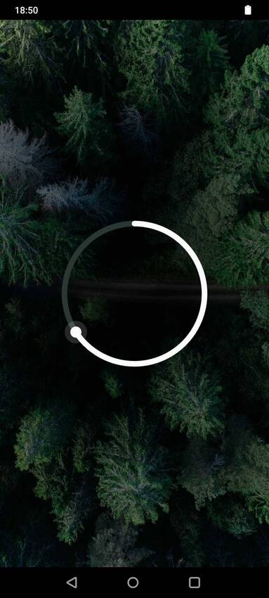
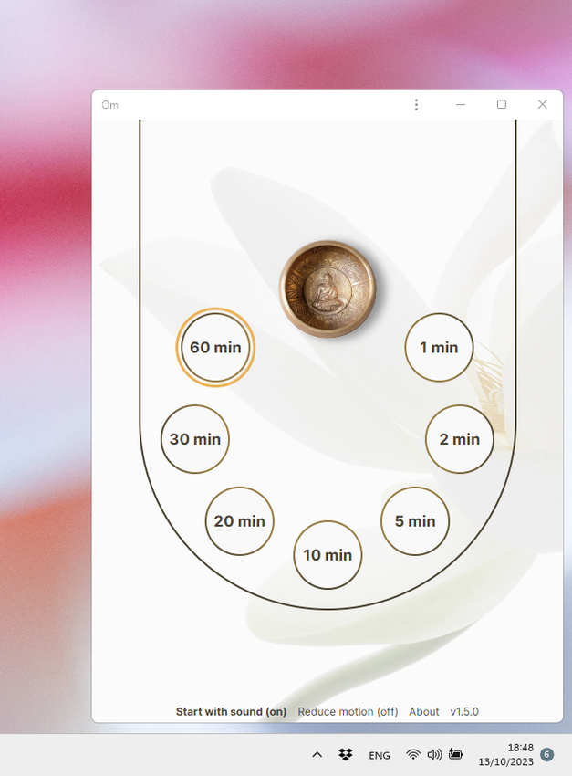

 

<h3 align="center">OM</h3>

    App available online at <b><a href="https://om.samueleiche.com">om.samueleiche.com</a></b>

 

This mindfulness app makes sound at intervals to encourage regular breaks and to remind you to pause, breathe and center yourself throughout the day.

## What is Mindfulness?

> Mindfulness is the continuous practice of touching deeply every moment of daily life. To be mindful is to be truly present with your body and your mind, to harmonize your intentions and actions, and to be in harmony with those around you. \
>  — Thich Nhat Hanh, Zen master

Mindfulness can be practiced at any time, whether we are in the office, kitchen, or bathroom. We can invite mindfulness into our daily activities such as sitting, working, and eating, and so on - with mindful awareness of what we're doing.

More about mindfulness [here](./MINDFULNESS.md).

## How (and Why) to Use the Mindfulness Reminder

> The opposite of mindfulness is forgetfulness. — Thich Nhat Hanh

Taking small moments during the day to connect with the body, and to the present moment, can greatly increase happiness and ease.

Our tendency is to forget that we are in the present moment right now or that we are breathing. It's common to lose awareness while working on computers. Similar to physical exercise, the longer we go without practicing mindfulness, the more challenging it becomes to start again.

> Short moments repeated many times. — Tulku Urgyen Rinpoche, from his book "As It Is"

Developing a habit of mindfulness begins with making small, consistent commitments. A short duration of mindful practice guarantees it is authentic. If we force ourselves into longer practices, our minds can become dull or restless and we lose the essence of awareness.

A bell programmed to make sound at intervals can remind us to stop and be present again when we have been forgetful. In the **Om** app, you can set reminders at intervals that suit you.

Whenever the bell sounds, you can use it as a cue to pause what you are doing and take three mindful breaths, returning to the here and now, reconnecting with your body. Even for only a few moments, you have a chance to check in with yourself. After enjoying a few breaths, you may notice that you have become tense, need to straighten your back, or that you have moved away from your intended task.

Explore a variety of mindfulness practices [here](/PRACTICES.md).

#### Meditation Support

> Stress is caused by being "here" but wanting to be "there" — Eckhart Tolle

**Om** can aid your meditation practice. While meditation typically requires very little, a recurring bell can be practical and offer several benefits:

-   Continuous alertness: The sound of the bell can remind us to return to our original intention if our mind has started to wander.
-   Undivided attention: Guided by a timer, we can wholly immerse ourselves in our practice. By temporarily relaxing thoughts of the past and future, we can be fully present, unconcerned about how long we've meditated for or when to end our session.
-   We avoid overdoing it: We might get carried away and meditate for too long, leading to discomfort or loss of interest. A timer set to a short interval can prevent this by gently ending the session. Stopping a meditation session earlier than we would like to leads us to wanting more later.

## Features

-   A progressive web app (PWA)
-   -   Cross-platform compatibility: web apps run in web browsers, making them accessible on various platforms and devices regardless of their operating system
-   -   Installable like an app
-   -   Works offline
-   Select a predefined time interval option (1, 2, 5, 10, 20, 30, or 60 minutes)
-   Indefinite looping of selected time interval
-   A few settings for user preferences
-   Simple, minimal and meaningful design

#### Limitations

Modern browsers optimize memory and performance by suspending inactive tabs, which stops the timer and sound playback. To avoid this you can follow the next steps:

1. **Desktop browsers:** browsers like Google Chrome offer a Memory Saver feature. To ensure continuous functionality, add the site to the ignore list or install the app (recommended) to keep it active. You can install it either from the "Install" option in the menu footer, the button next to the browser's search bar, or from the browser's three-dot menu.

2. **Mobile browsers:** the app may stop when it is running in the background or when the screen is off. This behavior is due to how the device handles background processes. The **[Screen Wake Lock API](https://developer.mozilla.org/en-US/docs/Web/API/Screen_Wake_Lock_API)** helps with this issue by preventing the screen from turning off when the timer is running. Be mindful that having the screen on for long periods can lead to increased battery consumption.

#### Screenshots

&nbsp;&nbsp;

## Credits & Gratitude

-   Inspired by:
-   -   Futureproof's _Awareness_
-   -   Thich Nhat Hanh's _Mindfulness Bell_
-   Sound effect: Ben Burnes
-   Bowl image: SivanaSpirit
-   Background images: Geran de Klerk, Bahman Farzad, Otaka Photos

## Share the Gift of Mindfulness

**Om** is offered for free, indefinitely. I designed it with my own well-being in mind, but I believe it has the potential to benefit anyone. Please feel free to share it with anyone who may find value in it.

## Licence

The [code](https://github.com/samueleiche/om.samueleiche.com) is licensed under [MIT](./LICENCE).
