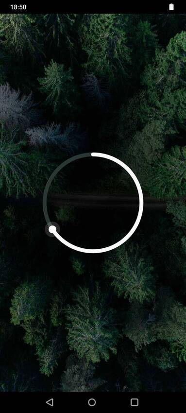
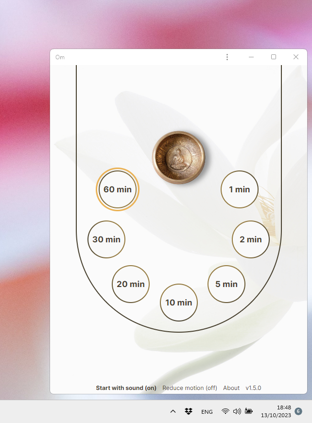

<br>

<h3 align="center">OM</h3>
<h4 align="center">A Minute for Mindfulness</h3>

<p align="center">
    App available online at <b><a href="https://om.samueleiche.com">om.samueleiche.com</a></b>
</p>

<br>

This app makes sound at intervals to encourage regular breaks and to remind you to pause, breathe and center yourself throughout the day.

## The Meaning

**OM** (Tibetan: ༀ; Sanskrit: ॐ; Romanized: Om̆̇) is the best-known **seed syllable** (_bīja_): a figurative symbol of the potential for something to unfold or develop, and its basic cause.

## What is Mindfulness?

> Mindfulness is the continuous practice of touching deeply every moment of daily life.\
>  — Zen Master Thich Nhat Hanh

As mentioned in **The Meaning**, the syllable represents potential. Mindfulness is the act of watering that seed. We all possess a natural capacity for well-being and clarity, but in the rush of work and daily activity, these qualities remain uncovered. By cultivating brief moments of awareness, we create the conditions for this potential to unfold.

In the traditional sense, mindfulness means to remember or to keep in mind; it is the result of first establishing the foundations of mindfulness (_satipaṭṭhāna_) through dedicated practice.

**_Satipaṭṭhāna_**: the establishing (_upaṭṭhāna_) of mindfulness (_sati_) is a meditative technique for training the mind to keep mindfulness firmly established in a particular frame of reference in all its activities.

Ṭhānissaro Bhikkhu writes:

> The role of mindfulness is to keep the mind properly focused in frames of reference that will give it guidance in what to develop, and which ones to abandon, so as to keep it on the right path. To make an analogy, mindfulness is what remembers to keep attention focused on the road to the mountain, rather than letting it stay focused on glimpses of the mountain or get distracted by other paths leading away from the road.

Mindfulness doesn't require mastery to be effective, as even short moments of refined attention on something meaningful are an invaluable gift to yourself.

## Features

The app is built as a Progressive Web App (PWA):

- **Cross-Platform**: Runs in any widely-used browser on mobile or desktop.
- **Installable**: Behaves like a native app once added to your home screen or desktop.
- **Offline Access**: Works without an internet connection after the first use.
- **Minimalist Design**: Simple, focused, and meaningful by design.

**Notes on usage:**<br>Modern browsers often optimize memory by suspending inactive tabs. Installing the app directly to your device or adding it to your browser's "Memory Saver" ignore list ensures the timer isn't silenced.

On mobile devices, the app may go idle when running in the background or when the screen is off due to system optimizations and [PWA constraints](https://bugs.chromium.org/p/chromium/issues/detail?id=889077). To help with this, the [Screen Wake Lock](https://developer.mozilla.org/en-US/docs/Web/API/Screen_Wake_Lock_API) is used to prevent the screen from turning off while the timer is running. Please note that keeping the screen active may increase battery usage.

#### Screenshots

<table>
    <tr>
        <td>
            
        </td>
        <td>
            
        </td>
    </tr>
</table>

## Development

```bash
# clone repo
git clone https://github.com/samueleiche/om.samueleiche.com.git

# install dependencies
npm i

# run app at https://localhost:5173
npm run dev
```

## Credits & Gratitude

- Inspired by:
    - Futureproof's Awareness
    - Thich Nhat Hanh's Mindfulness Bell
- Sound effect: Ben Burnes
- Bowl image: SivanaSpirit
- Background images: Geran de Klerk, Bahman Farzad, Otaka Photos

## Sharing the Gift of Mindfulness

The app is usable online for free. I designed it with my own well-being in mind and believe it has the potential to benefit anyone. Please, feel free to share it with anyone who may find value in it.

## Licence

The [code](https://github.com/samueleiche/om.samueleiche.com) is licensed under [MIT](./LICENCE).
